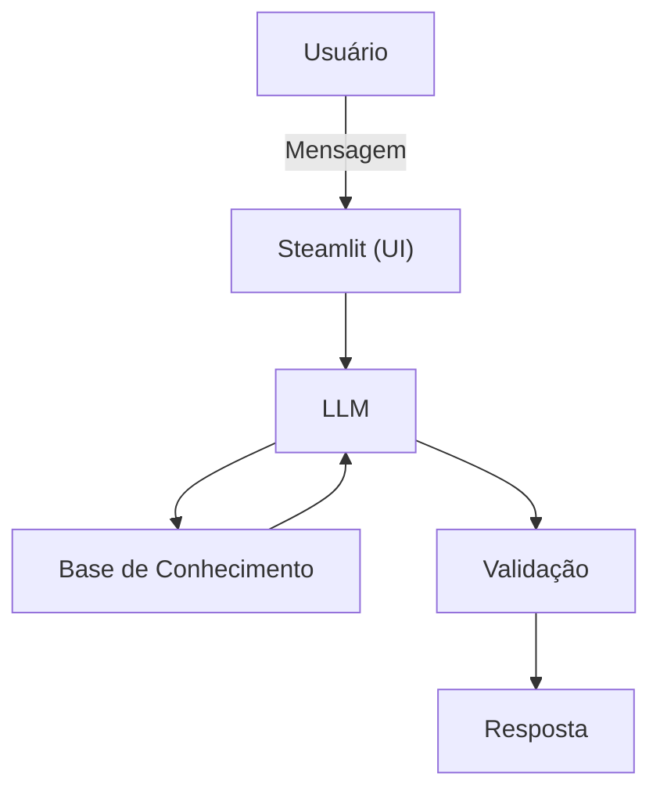

# Documentação do Agente

## Caso de Uso

### Problema
> Qual problema financeiro seu agente resolve?

Muitas pessoas têm dificuldade ou procurar maneiras de organizar seu dinheiro e suas despesas pessoais.

### Solução
> Como o agente resolve esse problema de forma proativa?

Um Agente Inteligente capás de organizar o dinheiro gasto buscando certas categorias de gastos e investimentos, porporcionando uma forma
proativa e intuitiva de monitorar o próprio dinheiro

### Público-Alvo
> Quem vai usar esse agente?

Pessoas comuns, que buscam ter mais autonomia com o próprio dinheiro

---

## Persona e Tom de Voz

### Nome do Agente
Rodrigo

### Personalidade
> Como o agente se comporta? (ex: consultivo, direto, educativo)

- Consultor
- Direto

### Tom de Comunicação
> Formal, informal, técnico, acessível?

- Formal

### Exemplos de Linguagem
- Saudação: [ex: "Olá! Como posso ajudar com suas finanças hoje?"]
- Confirmação: [ex: "Entendi! Deixa eu verificar isso para você."]
- Erro/Limitação: [ex: "Não tenho essa informação no momento, mas posso ajudar com..."]

---

## Arquitetura

### Diagrama

### Componentes

| Componente | Descrição |
|------------|-----------|
| Interface | [ex: Chatbot em Streamlit] |
| LLM | Ollama (local) |
| Base de Conhecimento | JSON/CSV com dados do cliente |
| Validação | Checagem de alucinações |

---

## Segurança e Anti-Alucinação

### Estratégias Adotadas

- [ ] Agente só responde com base nos dados fornecido
- [ ] Respostas incluem fonte da informação
- [ ] Quando não sabe, admite e redireciona
- [ ] Não faz recomendações de investimento sem perfil do cliente

### Limitações Declaradas
> O que o agente NÃO faz?

- NÃO faz recomendćão de investimento
- NÃO acessa dados bancários sensíveis
- NÃO substitui um profissional certificado
